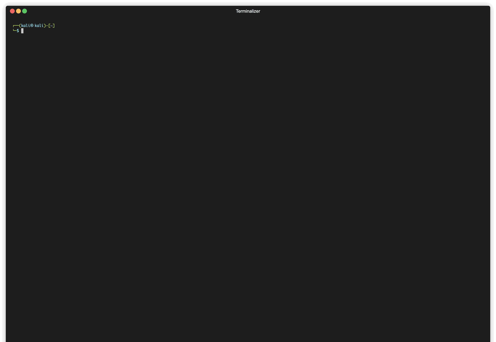

# NvChad-custom
In short, NvChad v2.5 is a true masterpiece, crafted with care and precision to provide you with 
the ultimate coding experience.

---

<p
    align="center">
    
</p>

---

## Pre-requisites

### Neovim - [brew](https://brew.sh)

```bash
$ brew install neovim
```

### NvChad Configuration

```bash
$ rm -rf ~/.cache/nvim ~/.local/share/nvim/ ~/.config/nvim
$ git clone https://github.com/elulcao/NvChad-custom.git --depth 1 $HOME/.config/nvim
$ nvim
```
